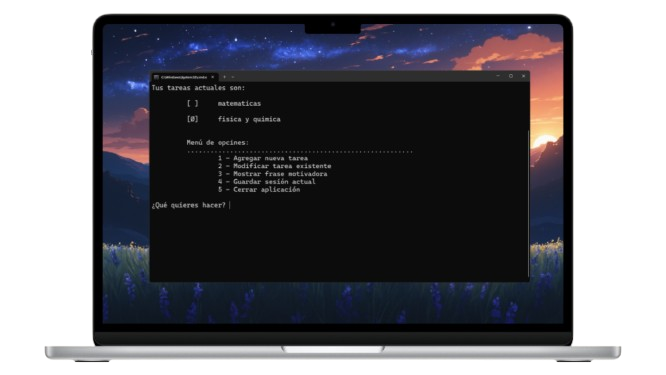

# Ultimate To-Do List

## 📋 Presentación del Proyecto

**Ultimate To-Do List** es una aplicación de consola desarrollada en Java que permite gestionar tareas de manera eficiente y motivadora. Diseñada como un proyecto para aprender sobre control de versiones con GitHub, esta aplicación combina funcionalidad práctica con una interfaz amigable. Los usuarios pueden crear, modificar y guardar tareas, además de recibir frases motivadoras para mantenerse inspirados. El programa incluye persistencia de datos en archivos binarios y un menú interactivo para una experiencia fluida.

### Funcionalidades Principales

- **Gestión de tareas**:
  - Crear nuevas tareas con un nombre y un estado inicial (pendiente o completada).
  - Modificar tareas existentes, permitiendo cambiar el nombre, el estado, ambos o eliminar tarea.
  - Visualizar la lista de tareas con un formato claro, usando símbolos (` `para pendiente, `Ø` para completada).
- **Persistencia**:
  - Guardar la lista de tareas en un archivo binario con un nombre único basado en la fecha.
  - Cargar tareas desde un archivo binario existente al iniciar el programa.
- **Frases motivadoras**:
  - Mostrar una frase motivadora aleatoria desde un archivo de texto (`frases_motivadoras.txt`) para inspirar al usuario.
- **Interfaz de consola**:
  - Menú interactivo con opciones para agregar tareas, modificarlas, mostrar frases motivadoras, guardar la sesión o cerrar la aplicación.

## 🖼️ Vista Previa



## 🚀 Cómo Funciona el Código

### Estructura del Código

El proyecto está implementado en Java y consta de dos clases principales:

- `Tarea.java`:
  - Representa una tarea con dos atributos: `nombre` (String) y `estado` (int, donde 0 es pendiente y 1 es completada).
  - Incluye getters y setters para acceder y modificar estos atributos.
  - Proporciona constructores para crear tareas con o sin estado inicial.
- `Main.java`:
  - Contiene la lógica principal del programa, incluyendo la interfaz de usuario, la gestión de tareas y el manejo de archivos.
  - Usa un array estático (`Tarea[] tareas`) para almacenar las tareas de la sesión actual.
  - Implementa métodos para cada funcionalidad.

## 🛠️ Instalación y Ejecución

1. **Clonar el repositorio**:

   ```bash
   git clone https://github.com/tu-usuario/tu-repositorio.git
   ```

2. **Abrir en Eclipse**:

   - Importa el proyecto en Eclipse como un proyecto Java existente.
   - Asegúrate de que la carpeta `resources/` contiene el archivo `frases_motivadoras.txt`.

3. **Ejecutar**:

   - Corre la clase `Main.java` desde Eclipse o compila y ejecuta desde la terminal:

     ```bash
     javac Main.java Tarea.java
     java Main
     ```

## 📝 Notas

- El método `limpiarPantalla()` usa códigos ANSI, que podrían no funcionar en todas las terminales (por ejemplo, CMD en Windows).
- Asegúrate de que las rutas de archivos sean válidas en tu sistema operativo.